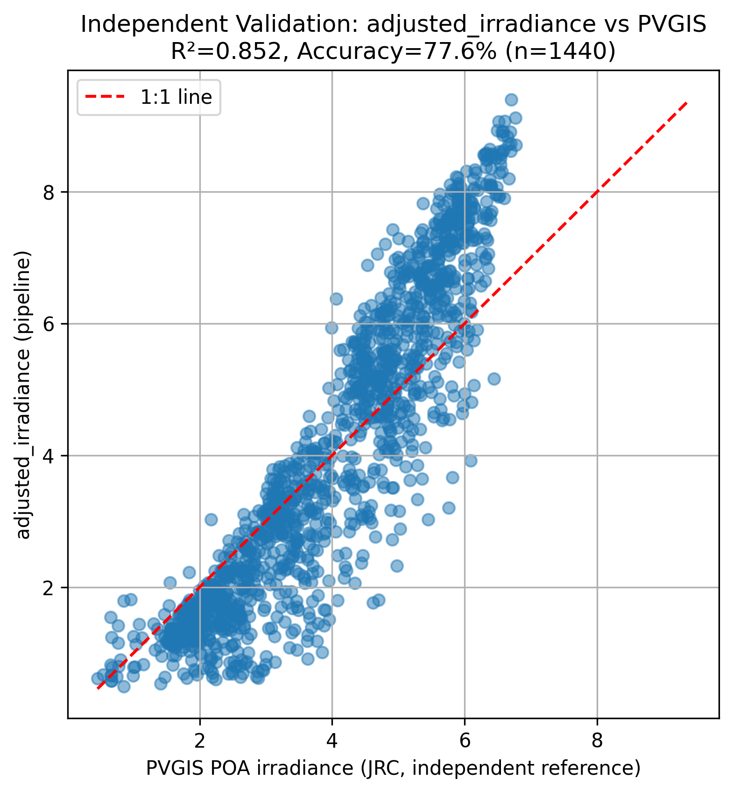
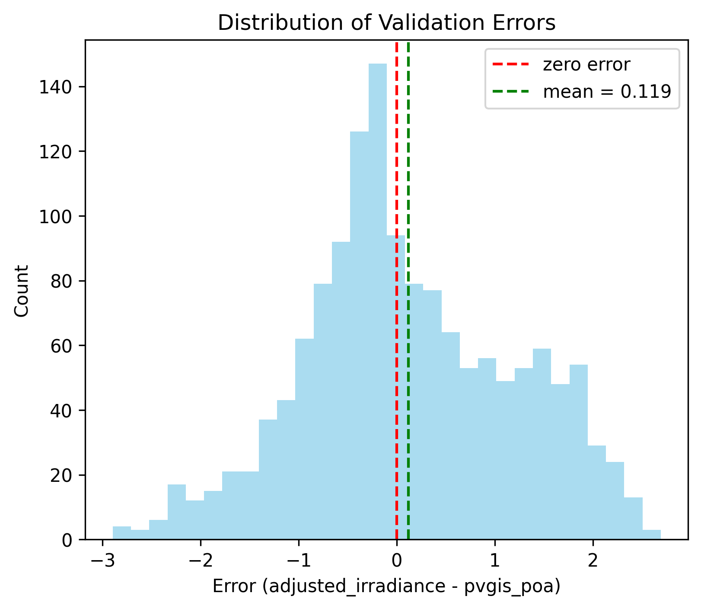
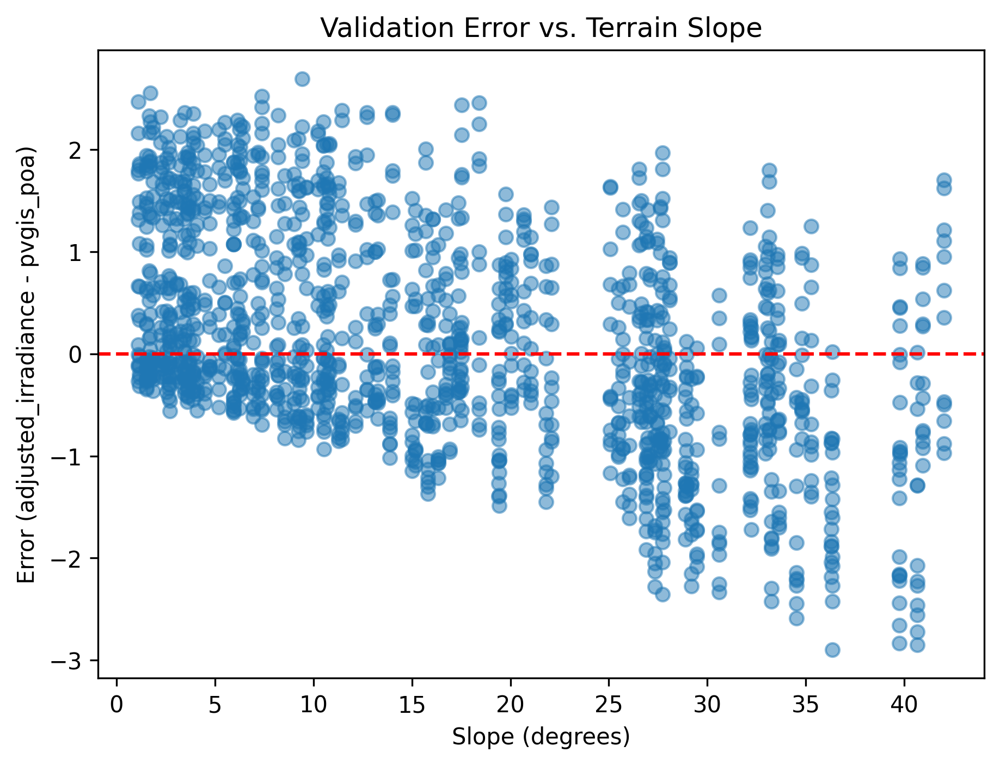
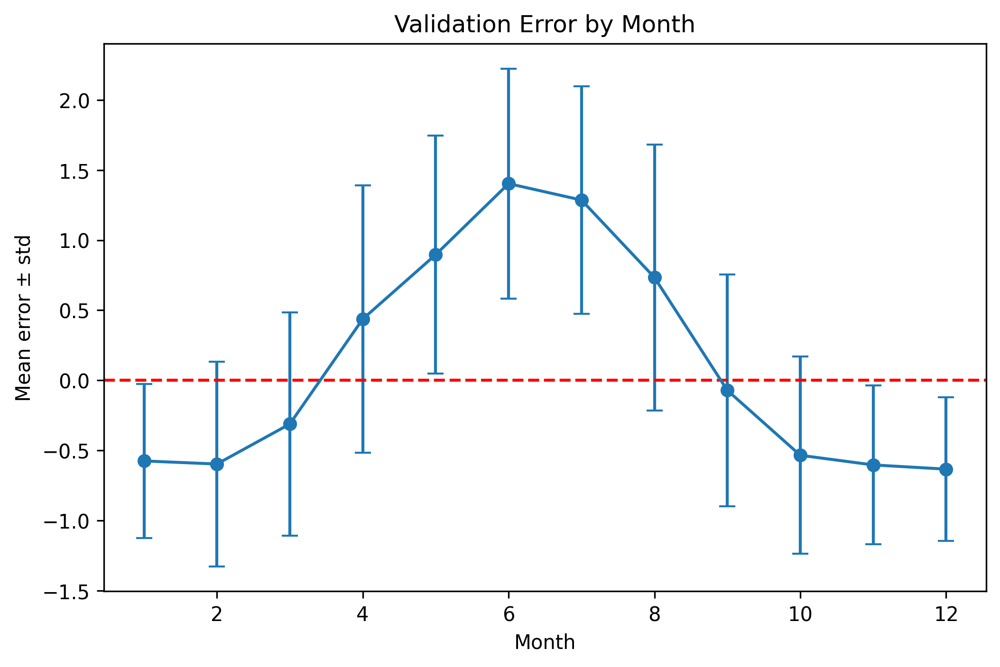

# Validation Summary

## Primary Validation: adjusted_irradiance vs PVGIS (independent)

| Metric | Value |
|---|---|
| Points compared | 1,464 (122 points × 12 months — see note below on n) |
| R | 0.9233 |
| R² | 0.8525 |
| MAE | 0.8632 kWh/m²/day |
| RMSE | 1.0816 kWh/m²/day |
| MBE | +0.1193 kWh/m²/day |
| MAPE | 22.38% |

## Residual Analysis

Three follow-up plots examine *where* the ~0.86 kWh/m²/day average error comes from,
rather than treating it as one flat number.

### Error distribution

This histogram shows how often each size of error happens across all data points. We can clearly see that  most of the error falls between -1 to 1 with the mean of error being 0.119. The distribution isn't a clean, symmetric bell curve, though. It is skewed with a secondary bump on the positive side. The month-by-month plot below explains why that happens.

### Error vs. slope

This checks if the model gets worse as terrain gets more steeper. If we look at the data that we can see that on average the typical error does not grow as slope inreases, however we can also see that plot gets more scattered/unpredictable as they slope grows.

### Error vs. month

This plot shows the mean error by month. It shows us that model overestimates irradiance in summer and underestimates it during winter.
This explains the skewed histogram above. Since the terrain-correction formula itself has no month-dependence beyond slope/aspect/declination, this pattern most likely comes from an earlier stage: the irradiance downscaling step assumes NASA POWER's monthly *seasonal shape* is reliable even though its absolute magnitude wasn't. This plot suggests that this assumption isn't perfectly clean — NASA POWER's seasonal curve for Georgia may be somewhat more exaggerated (too high in summer, too low in winter) than GSA's true monthly distribution, which isn't directly measurable since GSA only provides annual data for this region.

**Why this matters**: 
The main question of this project is about solar potential in Georgia during winter, so the fact that the model underestimates irradiance specifically in winter means the final suitability score is likely conservative for exactly the months this project cares about most. Since suitability is calculated directly from irradiance, underestimated input means an underestimated score. In other words, the real winter suitability of these locations is probably a bit *higher* than the model currently assumes.
